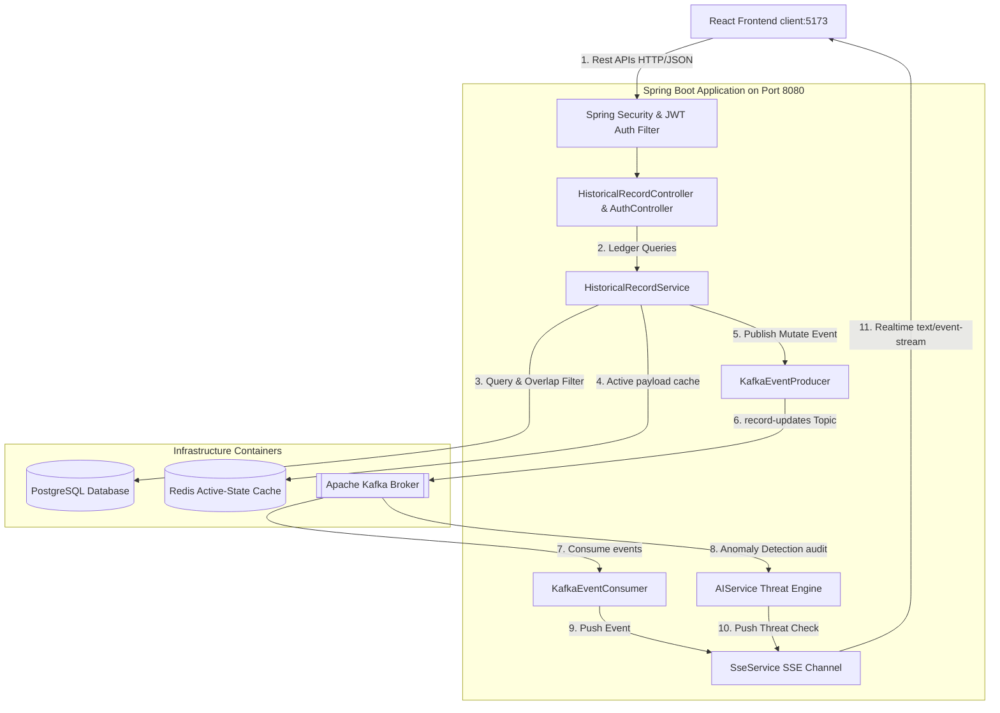

# ⏳ ChronosQuery

> An enterprise-grade **Bitemporal Time-Travel Database Debugger** and **AI-Driven Anomaly Detection Engine** built to audit, track, and visualize historical state changes in real-time.

---

## 🏗️ System Architecture



---

## ⚡ Core Features

1. **Bitemporal Time Travel Database**:
   - Manages state history using valid start/end system timestamps (`systemStartTime` and `systemEndTime`).
   - Implements bitemporal overlap SQL queries in Hibernate to query state records as they existed at any specific millisecond in the past.

2. **Real-time Event-Driven Pipeline (Kafka)**:
   - Every state mutation triggers a Kafka update event on the `record-updates` topic.
   - Independent service consumers process updates asynchronously, keeping system tasks decoupled.

3. **Asynchronous AI Security Inspector**:
   - Inspects state changes for SQL injections or structural tampering (such as unauthorized `DELETE` or `TRUNCATE` actions) and fires real-time threat alerts.

4. **Live Auditing Terminal (SSE)**:
   - Establishes a persistent Server-Sent Events (SSE) stream (`/api/records/events`) to broadcast events directly to the user dashboard in real-time.

5. **Interactive UI/UX Developer Dashboard**:
   - **Glassmorphic Layout**: Dark-themed workspace built with radial background glows and glassmorphism.
   - **Time-Travel Scrubbing Slider**: A range slider that lets the user scrub through a historical range, showing the active payload state at that timestamp and visually highlighting the active card node in the timeline with a glowing pink border.
   - **State Delta Diff Viewer**: Compares versions in real-time and highlights added (green), modified (yellow), or deleted (red) JSON fields.

---

## 🛠️ Tech Stack

* **Backend**: Spring Boot, Spring Security (JWT), Spring Data JPA, Hibernate, PostgreSQL, Redis, Apache Kafka.
* **Frontend**: React, Vite, Axios, Server-Sent Events (EventSource), Vanilla CSS.
* **DevOps**: Docker, Docker Compose, Kubernetes (Minikube).

---

## 🚀 Getting Started

### 1. Start Backing Infrastructure (Docker Compose)
From the root directory, spin up PostgreSQL, Redis, Zookeeper, and Kafka:
```bash
docker compose up -d redis zookeeper kafka
```
*(Note: If you have a local Postgres instance running on port 5432, you can use it directly, otherwise update `docker-compose.yml` to bind Postgres to an alternate port).*

### 2. Launch the Backend Server
Build and run the Spring Boot application on port `8080`:
```bash
./mvnw clean package -DskipTests
./mvnw spring-boot:run
```

### 3. Start the React Frontend
Install dependencies and run the Vite server on port `5173`:
```bash
cd frontend/chronos-frontend
npm install
npm run dev
```

Open **`http://localhost:5173/`** in your browser to inspect the application!
